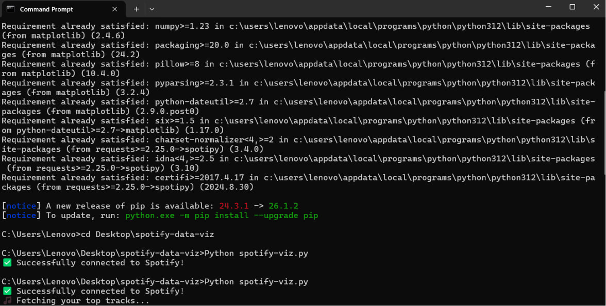

<link rel="stylesheet" href="spotify_visualization_tutorial.css">

## Introduction

Have you ever wondered what your favorite artist's music *actually* looks like? 🤔

In this tutorial, we're going to build a Python script that connects to the Spotify Web API, fetches an artist's top tracks, and plots their duration vs. popularity on a beautiful scatter plot using **Matplotlib**!

*Note: Spotify recently updated their API rules. Personal listening history (like "My Top Tracks") now requires an active Spotify Premium subscription, and their "Audio Features" endpoint was deprecated. To make sure EVERYONE can follow along and build this (even free accounts!), we will visualize public artist data instead. Let's get started!*


## Installing the Libraries

Open up your terminal (or command prompt) and install the two Python libraries we'll need:

```bash
pip install spotipy matplotlib
```

Here's what each one does:

- [`spotipy`](https://spotipy.readthedocs.io/en/2.22.1/): A lightweight Python library that makes it easy to talk to the Spotify Web API.
- [`matplotlib`](https://matplotlib.org/): The classic Python library for creating static, animated, and interactive graphs.

Once that finishes, create a new project folder and a file called **spotify_viz.py** inside it:

```
spotify-data-viz/
└── spotify_viz.py
```

Great! Let's write some code. 🐍

## Connecting to Spotify

To access Spotify's data through Python, we need permission. We do this by creating a "Developer App" on their platform.

1. Go to the [Spotify Developer Dashboard](https://developer.spotify.com/dashboard) and log in.
2. Click **"Create app"** and fill in the details. For the Redirect URI, use `http://127.0.0.1:8080/callback`.
3. Find your **Client ID** and **Client Secret**.

Because we are only looking at public artist data (not personal listening history), we can use `SpotifyClientCredentials`. This is great because it means **you don't need Spotify Premium to make this work!** Our script won't need to open a browser window to ask you to log in; it will just connect directly.

## Fetching an Artist's Top Tracks

Now for the exciting part — let's pull actual data from Spotify!

Instead of pulling your personal top tracks, we will search for an artist and grab their top 10 most-played songs. We can do this using the `sp.search()` and `sp.artist_top_tracks()` methods.

We will extract three things for each track:
- The **name** (so we can label our graph).
- The **popularity** (a score from 0 to 100 based on how much it's been played).
- The **duration** (which Spotify gives us in milliseconds, so we'll convert it to minutes!).

*Note: You can change `"Daft Punk"` in the code to any artist you like!*


## Creating the Visualization

Now we plot our data on a scatter plot. The X-axis will be the **Duration** of the song in minutes, and the Y-axis will be the **Popularity** (0 to 100). We'll style it with Spotify's signature green (`#1DB954`) and a dark background to match their app aesthetic. 

- **Top-right:** Long and highly popular = The mainstream anthems 🌟
- **Bottom-left:** Short and underground = The hidden gems 💎

Run the script, and a window will pop up showing your graph! It will also save a file called `my_spotify_vibes.png` in your folder.

### Step 6: Take Screenshots
The contest rules specifically ask for screenshots. 
1. Run your new code in the terminal: `python spotify_viz.py`
2. Take a screenshot of your terminal showing the `✅ Successfully connected to Spotify!` and the list of songs printing out. Add this image to your tutorial.
3. Take a screenshot of the final Matplotlib graph window that pops up. Add this image to your tutorial right below the visualization code.

*(Add your terminal screenshot here)*


## The Complete Code

Here's the full **spotify_viz.py** file, all in one place:

```python
import spotipy
from spotipy.oauth2 import SpotifyClientCredentials
import matplotlib.pyplot as plt
import sys

# Fix Windows CMD emoji crash
sys.stdout.reconfigure(encoding='utf-8')

# --- Authentication ---
# Replace these with your credentials from the Spotify Developer Dashboard!
CLIENT_ID = "PASTE_YOUR_CLIENT_ID_HERE"
CLIENT_SECRET = "PASTE_YOUR_CLIENT_SECRET_HERE"

if "PASTE_YOUR_" in CLIENT_ID or "PASTE_YOUR_" in CLIENT_SECRET:
    print("❌ Error: Missing Spotify credentials. Please paste them into the code.")
    sys.exit(1)

# We use ClientCredentials because we are searching public data, not personal data.
# This bypasses the Premium requirement!
sp = spotipy.Spotify(auth_manager=SpotifyClientCredentials(
    client_id=CLIENT_ID,
    client_secret=CLIENT_SECRET
))

print("✅ Successfully connected to Spotify!")

# --- Search for an Artist's Top Tracks ---
# Change "Daft Punk" to your favorite artist!
artist_name = "Daft Punk"
print(f"🎵 Fetching top tracks for {artist_name}...")

try:
    # Search for the artist
    result = sp.search(q=f"artist:{artist_name}", type="artist", limit=1)
    if not result["artists"]["items"]:
        print(f"❌ Could not find artist: {artist_name}")
        sys.exit(1)
        
    artist_id = result["artists"]["items"][0]["id"]
    
    # Get their top 10 tracks
    tracks_data = sp.artist_top_tracks(artist_id, country="US")["tracks"][:10]
except Exception as e:
    print(f"❌ Spotify API error: {e}")
    sys.exit(1)

track_names = []
popularity = []
duration_min = []

for track in tracks_data:
    track_names.append(track["name"])
    # Get popularity (0-100) and duration (convert from milliseconds to minutes)
    popularity.append(track["popularity"])
    duration_min.append(track["duration_ms"] / 60000)
    print(f"  • {track['name']}")

print(f"\n✅ Found {len(track_names)} tracks!")

# --- Create the Visualization ---
plt.style.use("dark_background")

fig, ax = plt.subplots(figsize=(12, 7))

ax.scatter(
    duration_min,
    popularity,
    color="#1DB954",     # Spotify Green
    s=120,
    edgecolors="white",
    linewidths=0.5,
    alpha=0.9,
    zorder=5
)

for i, name in enumerate(track_names):
    ax.annotate(
        name,
        (duration_min[i], popularity[i]),
        textcoords="offset points",
        xytext=(8, 8),
        fontsize=9,
        color="white",
        alpha=0.85
    )

ax.set_title(
    f"🎵 {artist_name} Top Tracks: Duration vs. Popularity",
    fontsize=18,
    fontweight="bold",
    pad=20
)
ax.set_xlabel("← Shorter · · · Duration (Minutes) · · · Longer →", fontsize=12)
ax.set_ylabel("← Underground · · · Popularity · · · Mainstream →", fontsize=12)

ax.grid(color="#535353", linestyle="--", linewidth=0.5, alpha=0.5)

plt.tight_layout()
plt.savefig("my_spotify_vibes.png", dpi=150, bbox_inches="tight")
plt.show()

print("✅ Visualization saved as 'my_spotify_vibes.png'!")
```

## Conclusion

Congratulations, you just built a full data pipeline! 🎉

Let's recap what we accomplished:

- **Connected** to a real-world API using OAuth authentication.
- **Fetched** personal data from the Spotify Web API using the `spotipy` library.
- **Parsed** JSON responses and extracted meaningful metrics.
- **Visualized** that data on a polished, Spotify-themed scatter plot with `matplotlib`.

These are real skills that data scientists, backend engineers, and full-stack developers use every single day. And you did it to analyze your own music taste. How cool is that? 😎

### Stretch Goals

Want to take this further? Here are some challenges:

1. 🔀 **Change the time range.** Swap `"short_term"` for `"long_term"` to see your all-time favorites. How different is your vibe?
2. 📈 **Go bigger.** Change `limit=10` to `limit=50` to visualize way more tracks. Does a pattern emerge?
3. 😊 **Plot different features.** Try `valence` (happiness) on one axis and `acousticness` on the other. What does *that* chart look like?
4. 📊 **Make a bar chart.** Instead of a scatter plot, create a horizontal bar chart ranking your top 10 tracks by danceability. (Hint: use `ax.barh()`!)
5. 🧑‍🤝‍🧑 **Compare with a friend.** Have a friend run the same script and compare your charts side by side!

### More Resources

- [Spotify Web API Documentation](https://developer.spotify.com/documentation/web-api)
- [Spotipy Documentation](https://spotipy.readthedocs.io/)
- [Matplotlib Tutorials](https://matplotlib.org/stable/tutorials/index.html)
- [Spotify Audio Features Reference](https://developer.spotify.com/documentation/web-api/reference/get-audio-features)
